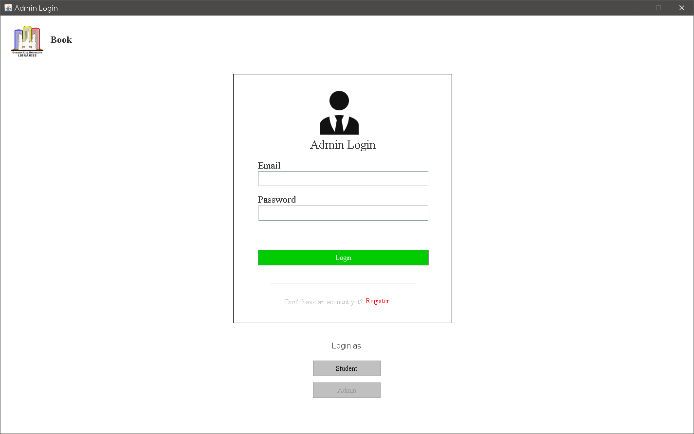
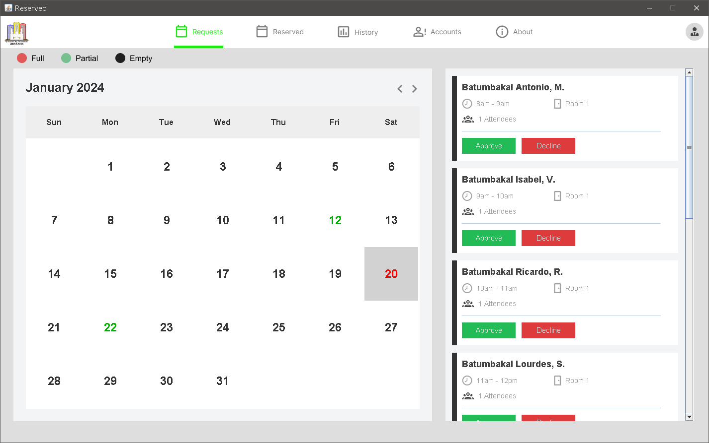
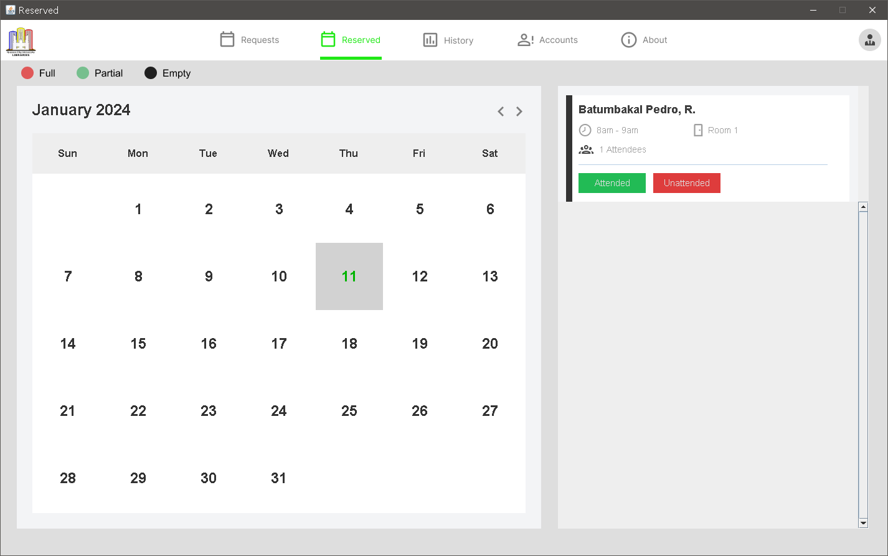
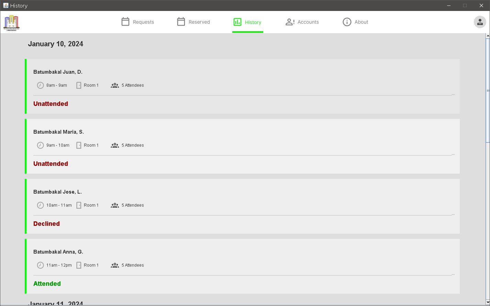
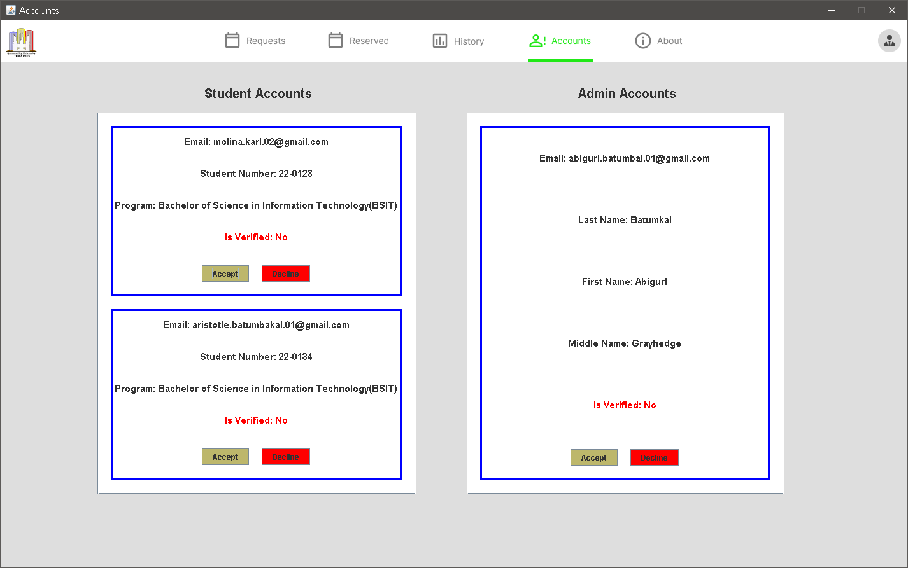
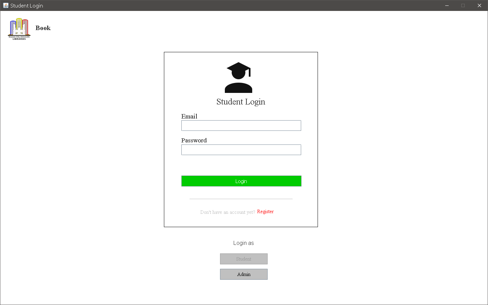
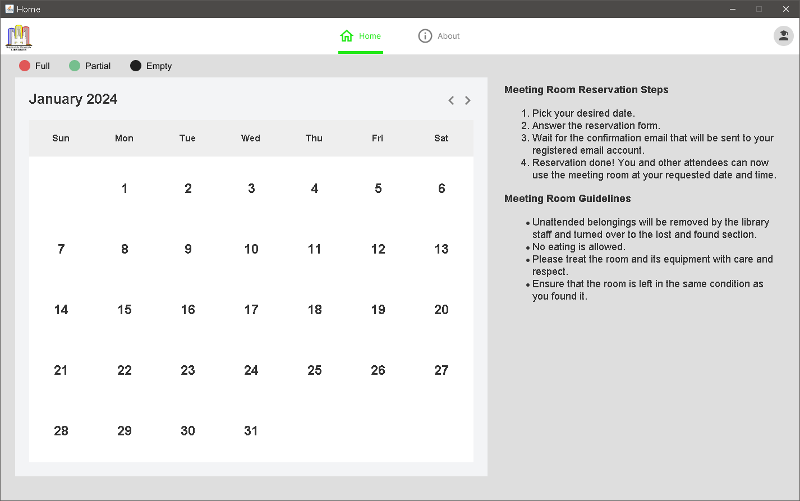
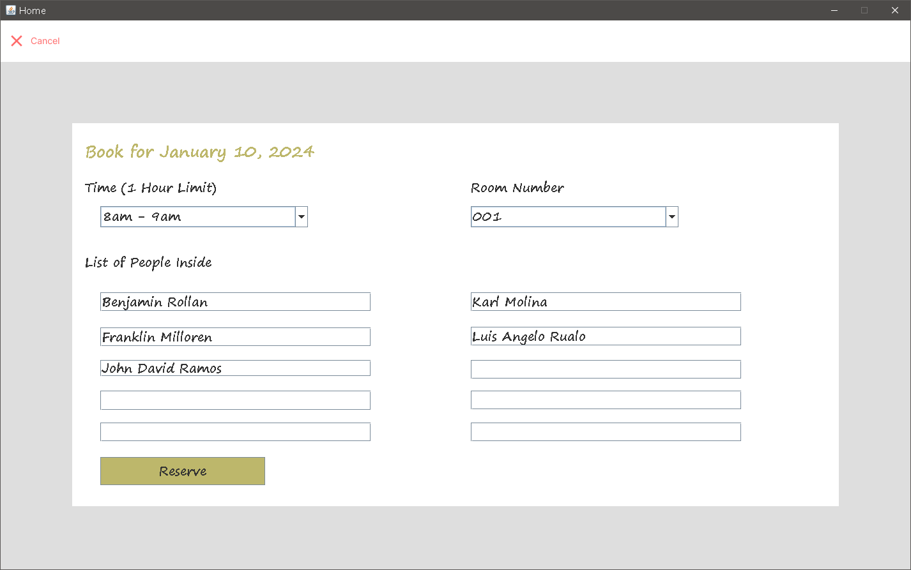
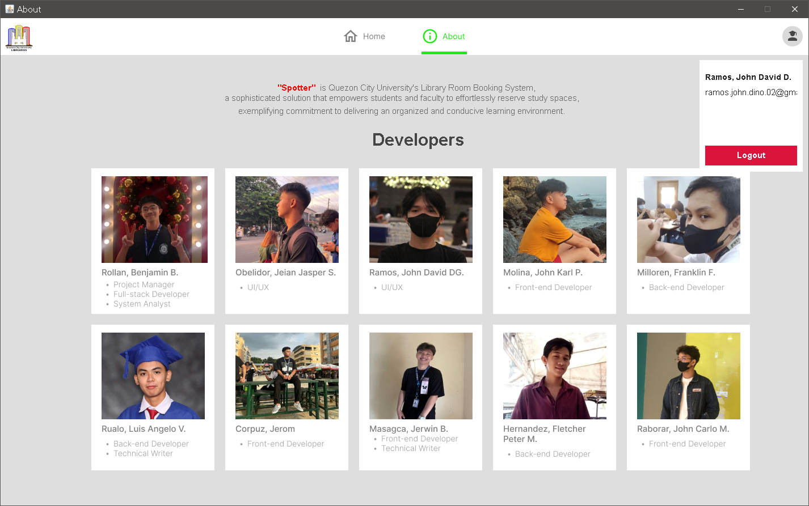

# Spotter: Quezon City University Meeting Room Reservation System
A university project. A user-friendly Meeting Room Booking System that simplifies the process of reserving meeting rooms within the library. All resources are free to use.

## Table of Contents

- [Images](#images)
- [Download](#download)
- [Guide](#guide)
- [Technologies](#technologies)

## Images

## Guide
To run the program, download "Spotter - Guide.pdf" and follow the instructions.

## Technologies

We used the following technologies to develop Spotter.

- [Java](https://www.java.com/en/)
- [Eclipse IDE](https://www.eclipse.org/ide/)
- [MySQL](https://www.mysql.com/)
- [XAMPP](https://www.apachefriends.org/)
- [Figma](https://www.figma.com/)
- [Visily](https://www.visily.ai/)
- [JavaMail API](https://www.oracle.com/java/technologies/javamail-api.html)
